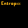

# Entropix (WIP)

Entropix is a 2D grid-based particle simulation game developed in C++. In this
small project, users can interact with different pixel elements that react with
one another based on specific physical and chemical rules.

This is a personal project primarily developed to practice and apply
Object-Oriented Programming (OOP) principles in a practical, visual C++
application.

# Showcase



## How to run the game

### Prerequisites

* A C++20 (or newer) compiler
* CMake (for the build system)
* SDL3 development libraries


### Build from source

1. Clone the repository: 

```bash
git clone https://github.com/yourusername/entropix.git
cd entropix
```

2. Build the project:

```bash
mkdir build && cd build
cmake ..
make all
```

3. Run the executable:

```bash
./src/entropix
```

## Features

* **Particle Interactions:** Various element types with distinct behaviors (e.g., gravity, fluid spreading (SOON), collisions).
* **Interactive Grid:** Tools to place or remove elements using mouse inputs, handled via SDL events.

## Roadmap

The project is currently under active development. Upcoming improvements include:
* **Multi-threading:** Partitioning the grid to process particle updates concurrently, allowing for larger simulation grids without frame drops.
* **Expanded Elements:** Adding new element types and complex chemical/physical interactions (heat, electricity).
